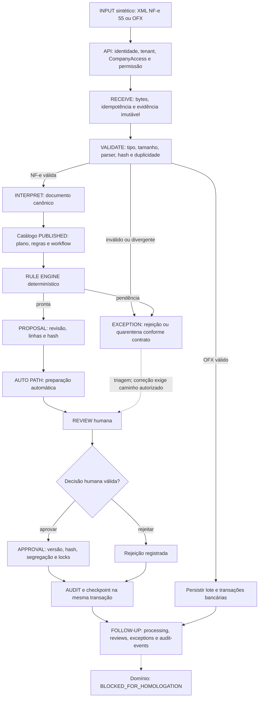

# Product Flow

Princípio: **AUTOMAÇÃO != DECISÃO PROFISSIONAL**. Fluxo conceitual: receber, validar, interpretar, aplicar regras, gerar proposta, identificar exceções, revisar, aprovar, registrar e acompanhar. O sistema externo permanece autoridade sobre escrituração, saldos e fechamento oficiais.

## Fluxo adaptado aos contratos existentes

Auditoria ocorre também durante recebimento, processamento e criação de proposta; a caixa AUDIT destaca a atomicidade da decisão, não o início da trilha. AUTO PATH nunca aprova. OFX possui importação própria; não se presume que alimenta a jornada NF-e. Uma pendência não cria autorização nem permite aprovar proposta inválida. A API não entrega escrituração oficial, e desbloqueio não retoma automaticamente trabalho.

Contratos reais: [API operacional](OPERATIONAL_API_MVP.md), `modules/workflow/application/journey.py`, `modules/workflow/application/services/nfe_to_dominio.py`, `modules/operations/application/services/operations.py` sob `src/serdial21/`. Revisão exige `expected_version`, `revision_id`, `revision_hash` e chave idempotente; consultas são autorizadas e não revelam recursos cross-tenant.

## Linha da Decisão

FEATURE NAME: **Linha da Decisão**. Conceito: SOURCE → PROCESSING → RULE → PROPOSAL → REVIEW → APPROVAL. Apenas mapeamento nesta fase, sem frontend ou API nova.

Fonte primária: `src/serdial21/modules/audit/domain/entities.py`. AuditEvent contém `id`, `tenant_id`, `company_id`, `actor_id`, `origin`, `module`, `action`, `subject_type`, `subject_id`, `subject_version`, `before`, `after`, `reason`, `correlation_id`, `causation_id`, `occurred_at`, `integrity_hash`. Campos opcionais não garantem preenchimento. O `_save` da jornada grava `origin=HUMAN` inclusive em transições coordenadas pelo serviço; não usar esse campo sozinho para afirmar que cada processamento foi manual.

NONE = dado requerido disponível no recorte indicado; PARTIAL = há evidência, mas falta projeção/correlação/detalhe; REAL_GAP = capacidade não encontrada. Um gap de apresentação não autoriza expor estados sensíveis.

| Etapa / necessidade | Dado existente | Contrato exposto / limite | Gap |
| --- | --- | --- | --- |
| SOURCE | Eventos de intake, `subject_type/id`, `nfe55.imported`, correlação; artifact e hash nos modelos de evidência/importação | AuditView fornece assunto e correlação; não fornece documento bruto nem toda a linhagem | PARTIAL |
| PROCESSING | `action`, `subject_version`, `occurred_at`; `after.status` e checkpoint Journey | AuditView não retorna `after`; processing oferece estado resumido | PARTIAL |
| RULE | `after.evaluation_id`; Journey.evaluation e PreparationPlan.release/rules no snapshot | AuditEvent não contém sozinho todas as versões e explicações de regra; exige consulta autorizada projetada | PARTIAL |
| PROPOSAL | `after.proposal_id`, `revision_id`, `revision_hash`; Journey.revision/lines/sources | Detalhe de reviews já retorna revisão/hash/linhas; histórico integral não é DTO de auditoria | PARTIAL |
| REVIEW | WorkItem, ApprovalRequest, versão da jornada e referências `work_item_id`, `request_id` | Não foi identificado evento específico de “usuário abriu/leu a revisão”; abertura de tela não prova revisão profissional | REAL_GAP para comprovação de leitura; PARTIAL para fila de revisão |
| APPROVAL | `actor_id`, ação, instante; `after.decision_id`, `revision_id/hash`, `effect_id`; Journey.decision | Decisão humana persistida; resumo AuditView não carrega todos os vínculos | PARTIAL |
| Identificação e ordem técnica básica | `id`, `subject_id`, `subject_version`, `correlation_id`, `occurred_at` | AuditView já os expõe sob `audit.read`; empate temporal não deve inventar ordem causal | NONE para identificação/versão por assunto |
| Integridade | `integrity_hash` persistido; `integrity_valid` no AuditView | Indicador de integridade disponível, não implica assinatura oficial externa | NONE para indicador atual |
| Timeline completa e segura | Evidências distribuídas entre auditoria, intake e checkpoints | Não há projeção agregada da Linha da Decisão; causation_id opcional não assegura cadeia completa | REAL_GAP |

Phase 09 deverá reaproveitar consultas existentes, definir DTO mínimo quando necessário e validar isolamento, permissões e fidelidade das versões. Não retornar `before/after/reason` irrestritos para completar a tela. Uma leitura de auditoria não concede leitura de documentos. Histórico é preservado; nenhuma alteração retroativa de eventos.
