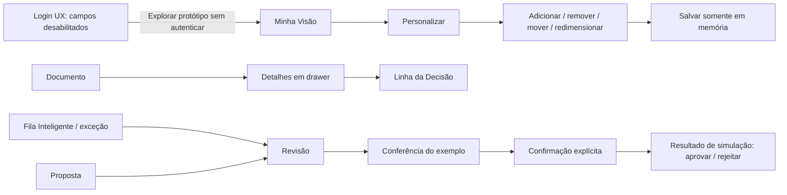

# UX Flows

## Fluxo Phase 08

CONTÁBIL → PROPOSTAS (paginadas/filtradas) → REVISÃO prioriza status, origem, regra/por quê, linhas compostas, totais do backend e evidências → confirmação explícita → APROVAÇÃO INTERNA ou REJEIÇÃO. A tela envia versão, revisão e hash; sucesso declara que não houve posting/export. Lock, falta de alçada, SOD, revisão alterada e decisão concorrente resultam em estados seguros.

USUÁRIO COM `catalog.review` → CATÁLOGO PUBLICADO → REGRA DETALHADA / CONTAS / MAPEAMENTOS, todos read-only. Edição e Linha da Decisão completa permanecem adiadas.

## Fluxos Phase 07

**NF-e:** selecionar empresa autorizada → abrir Fiscal · NF-e → informar arquivo XML e os quatro campos obrigatórios do contrato → receber estado de importação, duplicidade ou atenção → filtrar lista → abrir cabeçalho, tributos persistidos e itens → voltar ao receipt na Central. O fluxo termina antes da revisão/aprovação contábil.

**OFX:** selecionar empresa autorizada → abrir Financeiro · OFX → escolher arquivo → receber feedback → abrir extrato com conta mascarada → filtrar transações → ler Crédito + ou Débito − com o sinal original → voltar à Central. Conciliação, sugestão e match manual aparecem como adiados, sem botão operacional.

Ambos possuem loading, empty, error e forbidden herdados do shell. O feedback de upload usa região viva textual e não depende de cor. Troca de empresa e logout descartam respostas anteriores.

## Fluxos operacionais Phase 06

EMPRESAS → DETALHE → DOCUMENTOS: a lista nasce apenas de `/identity/me`; cada
detalhe revalida CompanyAccess. Abrir documentos seleciona a empresa e descarta
o estado anterior.

CAIXA DE ENTRADA → DOCUMENTO: mostra recebimentos recentes que exigem atenção.
CENTRAL DE DOCUMENTOS → FILTROS → DETALHE: consulta paginada por empresa, com
erro localizado, vazio e retry. O detalhe não mostra bytes ou storage.

TROCA DE EMPRESA invalida requisições/modelos antes da nova carga. Respostas
atrasadas são ignoradas. “Todas as empresas” exige seleção na Central.

UPLOAD informa o gap: nenhum sucesso é simulado e upload nunca é confundido
com processamento, aprovação ou escrituração.

## Atualização — Phase 05

`Minha Visão` agora é a home funcional do shell autenticado: `IDENTITY/ME -> CONTEXTO AUTORIZADO -> CATÁLOGO POR PERMISSÃO -> LOADING POR WIDGET -> READY/EMPTY/ERROR`. A troca de empresa invalida a geração corrente, descarta o estado anterior e recarrega apenas empresas presentes na projeção autenticada. `Todas as empresas autorizadas` usa a interseção conservadora de capacidades empresariais.

`DASHBOARD -> PRESET` aplica uma organização e remove widgets não autorizados. `DASHBOARD -> PERSONALIZAR -> ADD/REMOVE/MOVE/RESIZE -> SAVE` persiste localmente somente IDs, ordem, tamanho e preset. A preferência é revalidada antes de renderizar e nunca amplia acesso. Falha de um widget não cancela os demais; `401` retorna ao fluxo de sessão expirada e `403` elimina o conteúdo negado sem detalhe protegido.

Todos os dados de demonstração continuam sintéticos. Os destinos operacionais ainda não implementados aparecem desabilitados, sem simular funcionalidade.

## Atualização — Phase 04

O fluxo real agora parte de `app/index.html`: `BOOTING -> UNAUTHENTICATED -> OIDC` quando a integração for homologada, ou uma demonstração sintética explicitamente não autenticada. Após sessão válida, o shell carrega usuário, contexto e permissões antes de exibir conteúdo. `401 -> SESSION_EXPIRED -> LOGIN`; `403 -> FORBIDDEN`; `LOGOUT -> CLEAR SAFE STATE -> LOGIN`. Os contratos e gates estão em `AUTH_FRONTEND_INTEGRATION.md`. Os fluxos abaixo permanecem referência do protótipo da Phase 02.

## Fechamento — Phase 04B

`AUTH_MODE=OIDC` executa discovery, Authorization Code + PKCE S256, valida state/idade da transação, remove os parâmetros do callback, troca o código e chama `/api/v1/identity/me` antes de renderizar conteúdo. Configuração ausente falha fechada. `AUTH_MODE=SYNTHETIC` precisa estar declarado e exibe ambiente/dados sintéticos. A troca de empresa usa apenas a lista e as permissões retornadas pelo backend. Renovação exige novo login; logout remoto e revogação global dependem do IdP homologado.

Protótipo local da Phase 02; nenhuma alteração de backend. Rotas hash são páginas de apresentação, não endpoints. Mocks centralizados em `app/mocks.js`; nenhuma credencial, documento real ou ID fiscal é coletado. FRONTEND_PERMISSION_MODEL = DISPLAY_ONLY; SECURITY_AUTHORITY = BACKEND.

## Fluxos navegáveis

LOGIN → MINHA VISÃO: a ação de explorar é navegação pública do arquivo local, nunca sucesso de autenticação. OIDC permanece o contrato real; campos email/senha desabilitados explicam a dependência. Não há login social, MFA, magic link ou recuperação de senha funcional.

DOCUMENT → DETAILS → LINHA DA DECISÃO: selecionar uma linha define o documento sintético; drawer apresenta resumo e link ao histórico ou à revisão. Documento ausente/bloqueado por permissão deve receber mensagem uniforme no produto integrado.

EXCEPTION → REVIEW → DECISION: a Fila Inteligente permite abrir DOC-002 (regra ausente) ou DOC-003 (bloqueado). As ações permanecem desabilitadas nesses cenários. Não é permitido completar a exceção inventando regra/conta. DOC-001 demonstra o caminho de decisão, com duas interações deliberadas.

PROPOSAL → REVIEW → APPROVAL: origem, regra ilustrativa, débito/crédito, valor e evidência ficam visíveis. “Conferi o exemplo visual” habilita o caminho de simulação via validação no handler; o modal exige confirmação. O resultado é texto local, sem alteração do mock, persistência ou AuditEvent. Editar informa o contrato futuro, sem implementar regra contábil.

DASHBOARD → PERSONALIZE: cinco presets organizam dez widgets de seis tipos. Botões permitem mover e redimensionar sem mouse/drag. SAVE VIEW guarda um snapshot apenas em memória. Reset exige confirmação e apaga somente essa preferência efêmera. DASHBOARD_PERSISTENCE = DEFERRED_TO_PRODUCT_PHASE. Os presets nunca criam permissões.

AccountLock mostra motivo/escopo/ator/data fictícios e bloqueia ações do cenário. Nenhum desbloqueio foi criado. O fluxo real revalidará CompanyAccess, versão/hash, bloqueios, idempotência e segregação no backend, mesmo que um botão esteja visível.

## FRONTEND_DATA_GAP — 10 entradas

| SCREEN | REQUIRED DATA | CURRENT AVAILABILITY | GAP | TARGET PHASE |
| --- | --- | --- | --- | --- |
| Login | Redirecionamento OIDC, sessão/logout/expiração | Verificação bearer RS256 e identity existentes | UX/browser flow e IdP homologado; não coletar senha local | 04 / 11 |
| Shell | Menus/capacidades por contexto e empresa | AuthorizationService/CompanyAccess existentes | Projeção mínima de permissões e UX de troca; não criar autorização paralela | 04 |
| Minha Visão | Agregados globais e por empresa com período | Consultas operacionais limitadas | Endpoint/consulta de agregação autorizada; mock global não é total de página | 05 |
| Personalização | Layout por usuário e preferências vigentes | Nenhuma persistência de dashboard | Persistência/versão/validação de preferências; somente memória agora | 05 |
| Fila Inteligente | Prioridade/motivo/responsável/recebimento reunidos | Exceções e revisões resumidas | Projeção agregada e ordenação de prioridade aprovada | 05 / 08 |
| Documents / proposals | Paginação, filtros por datas/empresa/responsável e seleção | GET reviews com limit e consultas existentes | Contratos dos filtros/contagem/paginação não completos; operação local mock | 06 / 08 |
| Review | Edição de linhas e nova revisão preservando hash/aprovação | Detalhe e approve/reject já existem | Caso de uso/contrato de edição a confirmar; nenhuma nova API aqui | 08 |
| Linha da Decisão | Cadeia origem→regra→decisão e revisão humana | AuditView resumido + snapshots distribuídos | Projeção autorizada; evento de leitura/revisão não comprovado | 09 |
| Notificações | Feed, contador, leitura e entrega | Métricas locais não são feed do usuário | Contrato de notificações/entrega; aviso conceitual apenas | 12 / fase de produto a detalhar |
| Widgets de obrigações/conciliação/clientes | Vencimentos e pendências operacionais consolidados | Empresas existem; conciliação domínio parcial; obrigações sem módulo | Jornadas/fontes operacionais e regras de escopo futuras | 06 / 07 / planejamento de obrigações |

Nenhum gap bloqueia a demonstração sintética. Rótulo de mock não é requisito contábil aprovado. OFX demonstra recebimento/processamento próprios e não herda regra/proposta NF-e. A revisão aberta/lida no histórico aprovado é explicitamente fictícia; não modifica o registro histórico real.

## Gates e dívidas preservados

REAL DATA = NO_GO; EXTERNAL EXPOSURE = NO_GO; MIGRATION 0012 = PRE_DEPLOY_REQUIRED; DOMINIO_EXPORT = BLOCKED_FOR_HOMOLOGATION. REPOSITORY_HYGIENE_DEBT = TRACKED_LEGACY_VENV_FILES, NON_BLOCKING / SEPARATE_MAINTENANCE. STAGING_CONFIG = PENDING_ENVIRONMENT_PHASE. Nenhuma alteração de schema, dados, privacidade, autorização ou autenticação. Site da Phase 03 apenas inspecionado e preservado.

## Fase 09 — Linha da Decisão

Nos detalhes autorizados de documento, NF-e, extrato e proposta, a pessoa com `audit.read` vê a sequência fonte → processamento → regra → proposta → solicitação de decisão → aprovação/rejeição, conforme evidência real. Estados parcial, vazio e integridade inválida são explícitos. A fila de revisão entra pelo detalhe da proposta; a UI não afirma revisão humana apenas porque um item foi enfileirado.
