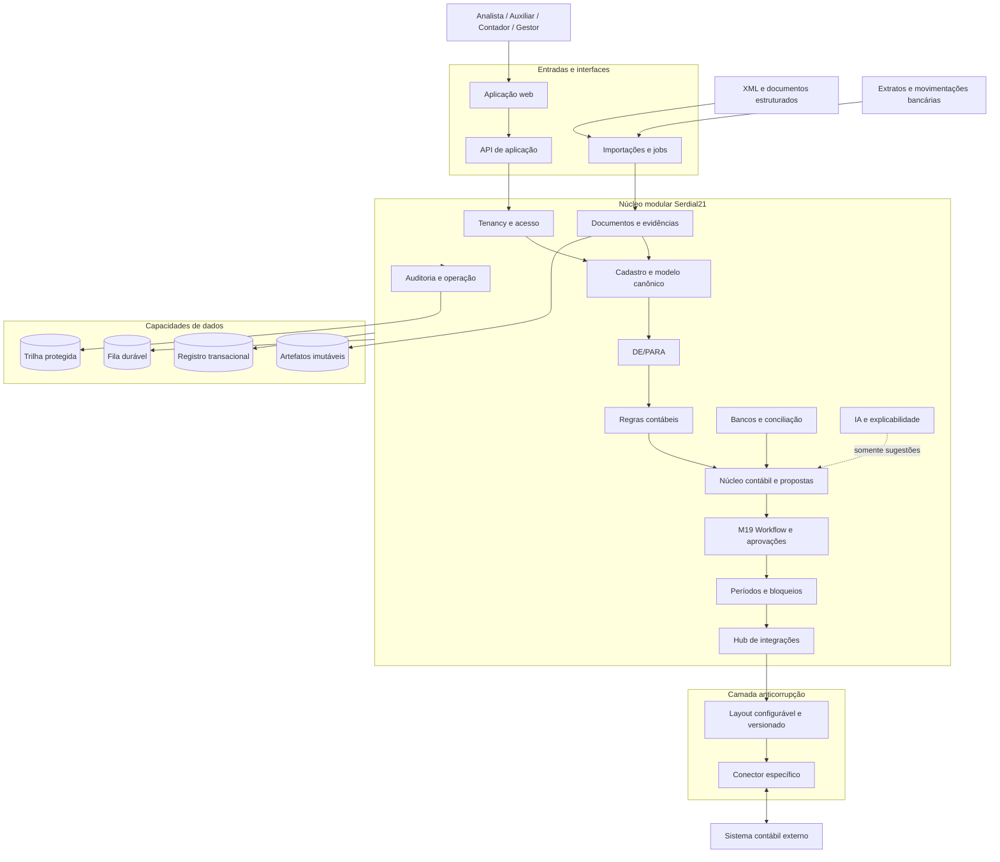
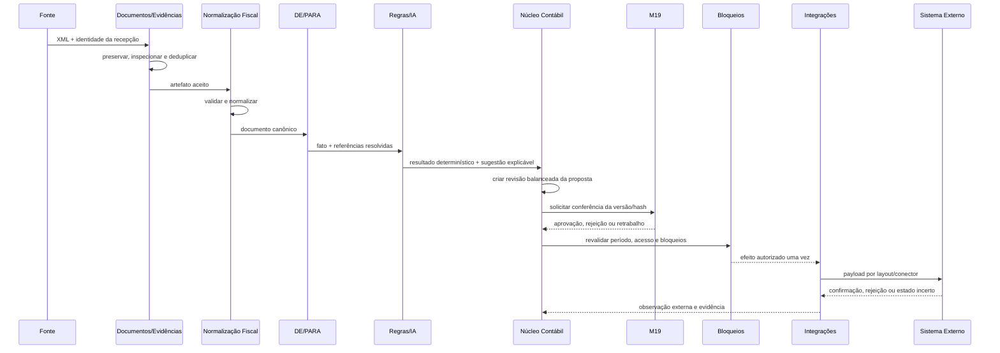
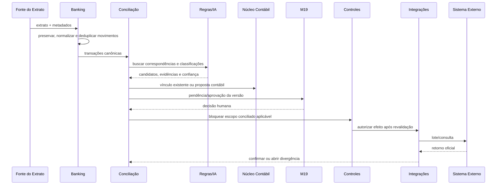

# Serdial21 — Arquitetura Macro, Domínios e Módulos

| Controle | Valor |
|---|---|
| Status | **APROVADA — baseline arquitetural vigente** |
| Versão | 1.0 |
| Baseline | Fase 1 v1.0 aprovada em 02/09/2026 |
| Aprovação | ARQ-01 a ARQ-10 aprovadas pelo responsável do produto em 02/09/2026 |
| Escopo | Arquitetura macro e limites de domínio; sem implementação ou seleção de fornecedor |

## 1. Resultado arquitetural proposto

O Serdial21 nasce como um **núcleo contábil próprio, modular e orientado a domínio**, mesmo que, no MVP, escrituração, saldos e fechamento oficiais permaneçam no sistema externo.

Isso evita uma ferramenta auxiliar descartável. `Account`, `JournalEntry`, `JournalLine`, `AccountingRule`, `AccountingPeriod`, `Reconciliation` e `AccountLock` existem desde o primeiro slice como objetos reais de negócio. O sistema externo determina a oficialidade da escrituração no MVP; não determina o modelo interno do Serdial21.

### Estilo recomendado

- Monólito modular Python no MVP, com limites internos verificáveis.
- Arquitetura de portas e adaptadores em cada domínio.
- Processamento síncrono para comandos locais curtos e assíncrono para ingestão, IA, lotes e integrações.
- Eventos de domínio e processos retomáveis entre módulos.
- Modelo relacional transacional como registro de negócio, armazenamento de objetos para artefatos e trilha de auditoria protegida.
- Conectores e execução de IA isolados atrás de contratos.
- Evolução para serviços independentes apenas onde volume, segurança, disponibilidade ou equipes justificarem.

Não se escolhem nesta entrega framework web, ORM, SGBD, fila, armazenamento, provedor de nuvem ou modelo de IA.

## 2. Visão lógica



## 3. Autoridade por domínio

| Domínio/estado | Autoridade no MVP | Regra de convivência |
|---|---|---|
| Identidade autenticada | Provedor de identidade configurado | Serdial21 consome identidade; governa vínculo e autorização |
| Membership, papéis e acesso a empresas | Serdial21 | Não são sobrescritos por integração contábil |
| XML/extrato bruto | Fonte emissora para o conteúdo; Serdial21 para o snapshot preservado | Original é imutável e mantém origem/hash |
| Dados canônicos, staging e linhagem | Serdial21 | Derivações apontam para origem e versões |
| Plano/contas sincronizados | Sistema externo para o conteúdo oficial; Serdial21 para versões importadas e aliases | Conflito abre pendência; nunca `last write wins` |
| Regras, máscaras e DE/PARA | Serdial21 | Versionados, vigentes e aprovados |
| Propostas e revisões de lançamento | Serdial21 | São pré-ledger; não alteram saldo oficial |
| Workflow, pendências e aprovações | Serdial21 | Aprovação referencia conteúdo imutável exato |
| Conciliação e bloqueios operacionais | Serdial21 | Fechamento externo permanece conceito separado |
| Escrituração, número oficial e saldo | Sistema contábil externo | Só retorno confirmado muda a situação externa observada |
| Fechamento/reabertura oficial | Sistema contábil externo | Serdial21 mantém observação datada, não declaração própria |
| IA | Nunca é autoridade | Produz sugestão e explicação, sem porta privilegiada |
| Auditoria do processo Serdial21 | Serdial21 | Correção gera novo evento, preservando o original |

A autoridade deve ser configurável por domínio e, quando necessário, por campo, tenant, empresa e vigência. Cada objeto derivado preserva um snapshot da política de autoridade utilizada.

## 4. Decisões arquiteturais propostas

| ID | DECISÃO | MOTIVO | ALTERNATIVAS | IMPACTOS | RECOMENDAÇÃO |
|---|---|---|---|---|---|
| ARQ-01 | Unidade de implantação inicial | Transações contábeis e equipe inicial favorecem simplicidade | Microsserviços; monólito sem limites; monólito modular | Microsserviços elevam operação; monólito comum degrada limites; modular permite evolução | **Monólito modular com workers**, limites testados e contratos explícitos |
| ARQ-02 | Organização interna | Domínio não pode depender de HTTP, ORM, fila ou fornecedor | Camadas técnicas globais; active record; portas/adaptadores por contexto | Portas/adaptadores exigem disciplina, mas tornam regras testáveis e adaptadores substituíveis | **Domínio + aplicação + contratos + adaptadores por módulo** |
| ARQ-03 | Coordenação entre módulos | Ingestão e integrações são longas, falháveis e retomáveis | Transação distribuída; chamadas síncronas em cascata; eventos com orquestração | Eventos adicionam consistência eventual e observabilidade; evitam acoplamento/distribuição transacional | **Eventos versionados + orquestradores retomáveis + inbox/outbox** |
| ARQ-04 | Registro de dados | Integridade relacional, histórico e artefatos grandes têm necessidades distintas | Um banco para tudo; NoSQL primário; capacidades separadas | Separação aumenta operação, mas evita XML/documento em log e preserva integridade | **Relacional transacional + objetos imutáveis + fila durável + auditoria protegida** |
| ARQ-05 | Modelo contábil | Evolução a sistema principal não pode exigir reconstrução | Payload de exportação como modelo; modelo contábil próprio | Modelo próprio custa mais agora, mas preserva semântica, validação e futuro ledger | **Pré-ledger canônico completo desde o MVP** |
| ARQ-06 | Fronteira de fornecedores | Regra central não pode conhecer layouts proprietários | Mapeamentos dentro do motor; conectores diretos; camada anticorrupção | Camada adiciona contratos e versões, mas reduz custo de novos sistemas | **Canônico → layout versionado → conector específico** |
| ARQ-07 | Papel da IA | IA não pode criar efeitos críticos nem atravessar isolamento | IA embutida no domínio; agente com ferramentas; gateway consultivo | Gateway limita autonomia e exige aplicação explícita da sugestão | **IA como serviço consultivo, sem comando de aprovação/exportação/desbloqueio** |
| ARQ-08 | Aprovação | Aprovação de uma versão não pode valer para conteúdo alterado | Aprovar apenas ID; bloquear toda edição; aprovar hash/revisão | Revisão/hash exige versionamento, mas evita aprovação obsoleta | **Aprovação ligada à versão e resumo do conteúdo revisado** |
| ARQ-09 | Auditoria crítica | Não pode existir efeito sem trilha correspondente | Auditoria assíncrona; log técnico; registro atômico + projeção | Registro atômico aumenta custo transacional, mas elimina lacuna de responsabilidade | **Evento mínimo de auditoria no mesmo commit do efeito; projeção protegida posterior** |
| ARQ-10 | Isolamento | `tenant_id` em tela/API não é fronteira de segurança suficiente | Isolamento só na aplicação; defesa em profundidade; banco por tenant | Defesa em profundidade exige testes e contexto em todas as camadas | **Contexto autenticado + políticas comuns + chaves/consultas tenant-aware; topologia física a decidir** |

## 5. Domínios e módulos

| Contexto | Autoridade e objetos próprios | Responsabilidades | Não pode fazer |
|---|---|---|---|
| `access_control` | Tenant, membership, papel, permissão, CompanyAccess, identidade técnica | Contexto, autorização, segregação e acesso excepcional | Regras contábeis ou conteúdo documental |
| `company_registry` | Empresa, estabelecimento, contraparte, centro de custo, referências externas | Cadastro canônico e autoridade por domínio/campo | Sobrescrever fonte externa silenciosamente |
| `intake_documents` | Artefato, recebimento, lote, staging, extração, issues | Preservar origem, quarentena, deduplicar e reprocessar | Criar lançamento oficial |
| `fiscal_documents` | Documento/item/tributo/evento fiscal canônico | Validar e normalizar XML selecionado | Expor detalhes do XML ao núcleo contábil |
| `banking` | Conta, extrato e transação bancária canônica | Importar, normalizar e deduplicar movimentos | Aprovar contabilização |
| `chart_of_accounts` | Plano, versão de conta, conta referencial | Hierarquia, vigência, natureza e capacidade de lançamento | Criar conta por sugestão de IA |
| `mappings` | Conjuntos/versões/entradas DE/PARA | Resolver códigos com escopo, vigência e precedência | Executar transporte ou aprovar sozinho |
| `accounting_rules` | Regra, release, execução e trace | Selecionar e aplicar regras declarativas determinísticas | Mutação direta de proposta ou código arbitrário |
| `accounting_core` | Ledger, período, JournalEntry/Revision/Line, proposta e lote | Invariantes de partida, revisão e estado interno | Declarar saldo/fechamento oficial sem evidência externa |
| `reconciliation` | Caso, match, participante, alocação, exceção e decisão | Conciliar movimentos/documentos/lançamentos e explicar diferença | Gerenciar aprovação ou transporte |
| `accounting_controls` | Observação de período, AccountLock e bloqueio de período | Guardas comuns, reabertura e nova conferência | Confundir lock operacional com fechamento oficial |
| `workflow_m19` | Caso, item, atribuição, aprovação, decisão e efeito autorizado | Pendência, fila, SLA, alçada, rejeição e retrabalho | Editar diretamente o agregado sujeito |
| `ai_assistance` | Perfil, execução, sugestão, explicação e feedback | Classificar, sugerir, explicar, medir e falhar com segurança | Aprovar, desbloquear, publicar regra ou exportar |
| `integration_hub` | Conector, conexão, rota, layout, import/export, tentativa e retorno | Adaptar, transportar, confirmar, reconciliar e recuperar estado incerto | Incorporar regra contábil central |
| `audit_governance` | Evento de auditoria, acesso, finalidade, retenção e legal hold | Evidência de responsabilidade e governança de dados | Virar cópia irrestrita de dados operacionais |
| `operations` | Job, erro, fila, alerta e métricas técnicas | Saúde, retry controlado, replay e suporte | Substituir auditoria de negócio |

### Regras de dependência

- Cada contexto é dono das próprias invariantes e gravações.
- Nenhum módulo consulta diretamente a persistência privada de outro.
- Comunicação ocorre por contrato público, consulta autorizada ou evento versionado.
- `shared_kernel` contém apenas conceitos realmente universais, como IDs, dinheiro, datas, contexto, erros e envelope de evento.
- IA, conectores e jobs recebem capacidades mínimas; não recebem uma porta genérica de mutação.
- Workflow autoriza uma versão; o módulo proprietário revalida se a decisão ainda se aplica.
- Toda mutação recebe tenant, empresa, ator, canal, correlação e idempotency key.

## 6. Fluxos das verticais aprovadas

### 6.1 Vertical XML/documentos estruturados



Invariantes:

- O artefato original é selado antes da extração.
- Mesma chave e mesmo conteúdo resultam em reentrega idempotente; mesma chave com conteúdo diferente gera conflito.
- Particularidades do XML terminam no normalizador/layout.
- A proposta referencia documento, item/campo, parser, canônico, DE/PARA, regra e IA usados.
- Toda proposta com efeito contábil exige aprovação humana no piloto.
- Timeout de integração gera `RESULTADO_DESCONHECIDO`; não ocorre reenvio cego.

### 6.2 Vertical movimentação bancária



A conciliação pode vincular movimento a lançamento externo existente, gerar nova proposta, dividir/agrupar com rastreabilidade ou permanecer ambígua. Mesmo correspondência de alta confiança requer aprovação humana no piloto.

## 7. Estados separados do lançamento

Para não confundir “válido”, “aprovado” e “contabilizado”, `JournalEntry` mantém dimensões independentes:

| Dimensão | Estados mínimos | Autoridade |
|---|---|---|
| Preparação/validação | DRAFT, PROPOSED, VALIDATED, PENDING, CONFLICT, BLOCKED, SUPERSEDED | Serdial21 |
| Aprovação | NOT_REQUESTED, PENDING, APPROVED, REJECTED, EXPIRED, CANCELLED | M19/Serdial21 |
| Entrega | NOT_QUEUED, QUEUED, SENT, DELIVERY_ERROR, UNKNOWN, ACKNOWLEDGED | Integration Hub |
| Situação externa observada | UNKNOWN, ACCEPTED_EXTERNAL, REJECTED_EXTERNAL, POSTED_EXTERNAL, REVERSED_EXTERNAL | Evidência do sistema externo |

Regras:

- Revisão aprovada é imutável; mudança cria nova revisão e invalida aprovação pendente.
- `APPROVED` não altera saldo oficial.
- Número/status oficial só nasce de confirmação externa.
- Estorno ou ajuste após contabilização é nova operação vinculada.
- Débitos e créditos fecham antes da solicitação de aprovação.
- Conta, dimensão e período precisam ser válidos e não bloqueados no instante do efeito.

### AccountingPeriod e AccountLock

`AccountingPeriod` mantém separadamente:

- estado operacional interno: planejado, aberto, em revisão, bloqueado ou requer nova conferência;
- observação externa: desconhecido, aberto, fechado ou reaberto, com fonte e instante.

`AccountLock` é bloqueio de negócio durável, não lock técnico. Pode abranger conta, grupo, módulo, competência ou exercício e restringir aprovação, alteração, reprocessamento, conciliação ou exportação. Desbloqueio exige alçada, motivo e auditoria; alteração posterior em escopo conferido produz `REQUER_NOVA_CONFERENCIA`.

## 8. M19 — Workflow, Pendências e Aprovações

M19 é contexto próprio, não apenas tabela compartilhada. Cada caso referencia:

- tenant, empresa, objeto, versão e hash do conteúdo;
- motivo/código, risco, prioridade, prazo e fila;
- responsável, aprovador e segregação aplicável;
- evidências, regras e explicações de IA;
- decisão, justificativa e instante;
- efeito autorizado e chave causal única.

M19 publica a decisão; o módulo proprietário revalida versão, permissão e bloqueios antes do efeito. Uma aprovação da revisão 3 nunca aprova a revisão 4.

## 9. Integrações e consistência

```text
Domínio -> modelo canônico -> layout versionado -> conector específico -> sistema externo
```

- O canônico expressa semântica de negócio.
- O layout traduz campos, defaults e validações para uma versão externa.
- O conector trata autenticação, transporte, paginação, limites, retry, polling e callback.
- Um perfil de capacidades informa suporte a consulta de período, idempotência, lote, retorno e reconciliação.
- Lotes congelam versões de proposta, regra, DE/PARA, layout e payload.
- Retorno parcial é tratado por item e reconciliado por quantidade/valor.
- Não se usa transação distribuída; processos entre contextos são retomáveis.
- Inbox deduplica recebimentos e outbox garante publicação após commit.
- Retry reutiliza identidade e payload; estado desconhecido é consultado antes de reenviar.

### Envelope mínimo de comando/evento

- ID e versão do esquema.
- Tenant e empresa.
- Agregado, ID e versão.
- Ator humano/técnico/IA e canal.
- Correlação e causalidade.
- Idempotency key.
- Instante de ocorrência e registro.
- Política/autoridade aplicável.

Eventos iniciais do catálogo:

| Grupo | Eventos principais |
|---|---|
| Recepção | `ArtifactReceived`, `EvidenceSealed`, `DuplicateDetected`, `ArtifactQuarantined` |
| Normalização | `FiscalDocumentNormalized`, `BankTransactionsNormalized`, `ValidationIssueDetected` |
| Decisão | `MappingsResolved`, `RulesEvaluated`, `AISuggestionGenerated`, `AccountingProposalCreated` |
| Workflow | `WorkItemOpened`, `ApprovalRequested`, `ApprovalGranted`, `ApprovalRejected`, `ReworkRequested` |
| Contabilidade | `JournalRevisionValidated`, `JournalRevisionApproved`, `JournalRevisionSuperseded` |
| Conciliação | `ReconciliationProposed`, `ReconciliationApproved`, `ReconciliationReopened` |
| Bloqueio | `ControlLockActivated`, `ControlLockReleased`, `ReviewRequired` |
| Integração | `ExportBatchCreated`, `DeliverySent`, `DeliveryUnknown`, `ExternalPostingConfirmed`, `ExternalRejectionReceived` |

## 10. Permissões macro

Autorização combina papel, empresa, ação e estado do objeto. Capacidades distintas:

- importar documento/extrato;
- consultar evidência sensível;
- criar, testar, revisar e publicar DE/PARA ou regra;
- criar, revisar, aprovar ou rejeitar proposta;
- conciliar, reabrir, bloquear ou desbloquear;
- preparar, enviar, consultar ou reenviar lote;
- administrar layout, conexão e identidade técnica;
- consultar ou exportar auditoria;
- realizar suporte excepcional.

Identidades de IA e integração nunca recebem `approve`, `unlock` ou administração de permissões. A matriz detalhada é artefato de fase posterior.

## 11. Topologia lógica do MVP

| Unidade lógica | Responsabilidade | Escala/isolamento independente futuro |
|---|---|---|
| Interface/API de aplicação | Autenticação, comandos, consultas e UX | Pode escalar horizontalmente |
| Núcleo modular | Casos de uso e invariantes | Mantido junto no MVP para consistência |
| Workers de processamento | Parser, regras, reprocessamento, lotes | Escala por tipo/fila |
| Worker de conectores | Chamadas externas e reconciliação | Isolável por risco/fornecedor |
| Gateway/worker de IA | Redação, inferência, validação de saída e fallback | Isolável por dados/custo/provedor |
| Registro transacional | Estado de negócio e versões | Tecnologia e estratégia física pendentes |
| Armazenamento de objetos | XML, extrato, retorno e evidência | Criptografia/retenção próprias |
| Fila durável | Processos assíncronos e retry | Particionada por tenant/prioridade conforme volume |
| Trilha protegida | Auditoria imutável e consulta autorizada | Separação de acesso e retenção |

## 12. Decisões e informações ainda pendentes

- Tipos de XML fiscal incluídos no primeiro piloto.
- Formatos de extrato e regras de fingerprint bancário.
- Sistema contábil externo e capacidades reais do conector.
- Granularidade de lançamento por documento, item e conciliação.
- Regras de arredondamento, moeda e tolerâncias de conciliação.
- Validade máxima da observação de período externo.
- Papéis/alçadas para publicar regra, aprovar, reabrir e desbloquear.
- Política de retorno parcial e estado desconhecido.
- Volumetria, sazonalidade, SLA, RPO e RTO.
- Retenção de evidência, auditoria e dados de IA.
- Estratégia física de isolamento de dados.
- Frameworks, SGBD, fila, storage, nuvem e provedor de IA.

## 13. Registro de aprovação arquitetural

**ARQ-01 a ARQ-10 aprovadas em 02/09/2026.** O MVP seguirá como monólito modular com pré-ledger próprio, processamento assíncrono retomável e fronteiras fortes para integrações e IA. Alterações exigem novo registro de decisão e análise de impacto.
