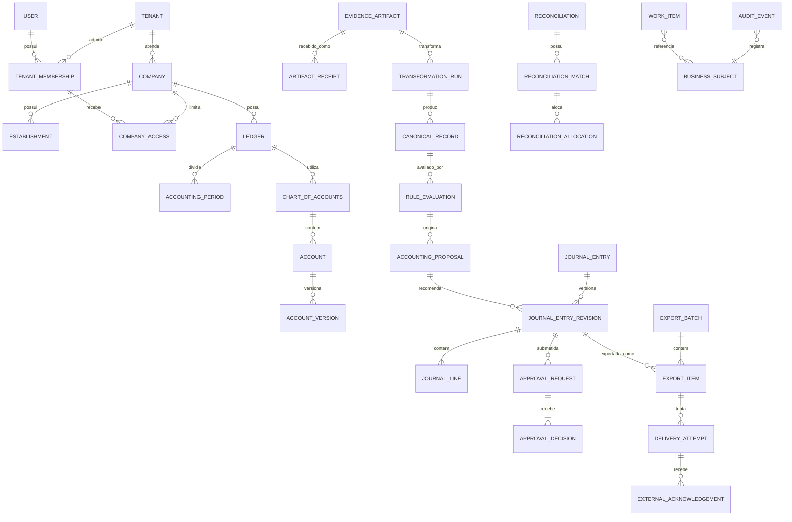

# Serdial21 — Modelo de Dados Conceitual e Lógico

| Controle | Valor |
|---|---|
| Status | **APROVADO — baseline lógica vigente** |
| Versão | 1.0 |
| Baseline | DAT-01 a DAT-10 aprovadas; arquitetura macro v0.1 |
| Aprovação | Modelo lógico aprovado pelo responsável do produto em 02/09/2026 |
| Escopo | Entidades, relacionamentos, estados, versionamento e invariantes; sem DDL ou SGBD definido |

## 1. Princípio de autoridade

O modelo separa a existência de uma entidade contábil canônica da autoridade sobre a escrituração:

- Serdial21 é autoridade para evidências preservadas, dados canônicos, regras, máscaras, DE/PARA, avaliações, propostas, workflow, aprovações, integrações, explicações e sua auditoria.
- O sistema contábil externo permanece autoridade para lançamentos efetivados, números oficiais, saldos e fechamento/reabertura oficial no MVP.
- `JournalEntry`, `JournalLine`, `Account`, `AccountingPeriod`, `Reconciliation` e `AccountLock` existem desde o início como pré-ledger canônico e auditável.
- Preparação, validação, aprovação, entrega e situação externa são dimensões separadas.

`DomainAuthorityPolicy` declara, por tenant/empresa/domínio/campo e vigência, quem é a autoridade, o modo de integração, alterações permitidas e versão aprovada. Cada processamento preserva a política utilizada.

## 2. Convenções transversais

### Identidade e escopo

- Toda entidade possui identificador interno opaco e estável (`id`). A tecnologia do identificador será decidida posteriormente.
- `tenant_id` é obrigatório e imutável em todo dado pertencente a escritório.
- `company_id` é obrigatório nos dados de empresa, ainda que inferível pelo pai.
- Relações empresariais validam tenant e empresa dos dois lados; ID válido nunca substitui autorização.
- Identidades externas ficam em `ExternalReference`; nunca substituem a chave interna.
- Chaves naturais e de idempotência são únicas dentro do tenant e, quando aplicável, empresa/conexão.

### Tempo, versão e estado

- `effective_from/effective_to`: vigência no negócio.
- `recorded_at/superseded_at`: quando o Serdial21 conheceu ou substituiu a informação.
- `status`: ciclo operacional, distinto de vigência.
- `version_no` e `previous_version_id`: conteúdo histórico exato.
- `created_at/by`, `updated_at/by` e versão de concorrência: autoria e proteção contra atualização perdida.
- `correlation_id` e `causation_id`: linhagem entre processos.

Versões publicadas, evidências, avaliações concluídas, decisões, revisões aprovadas e payloads enviados são imutáveis. Correção cria nova versão ou novo evento.

### Persistência lógica recomendada

| Capacidade | Conteúdo | Regra |
|---|---|---|
| Registro transacional relacional | Entidades, versões, relações e estados | Integridade referencial e transações locais fortes |
| Armazenamento de objetos | XML, extrato, comprovante e retorno bruto | Conteúdo imutável, hash, criptografia, retenção e acesso segregado |
| Trilha de auditoria protegida | Eventos de responsabilidade e acesso | Append-only, minimizada e resistente a adulteração |
| Inbox/outbox e jobs | Idempotência, publicação e retomada | Não pressupõe produto de fila específico |

O SGBD, storage e fila permanecem decisões tecnológicas pendentes.

## 3. Visão relacional simplificada



O diagrama mostra relações centrais; o catálogo abaixo é a fonte conceitual. Entidade lógica não implica obrigatoriamente uma tabela física exclusiva. `BUSINESS_SUBJECT` é apenas uma notação do diagrama para “objeto de negócio versionado”; não propõe tabela genérica. As referências concretas são validadas por `WorkItemSubject` e pelos campos de sujeito da auditoria.

## 4. Catálogo de entidades

### 4.1 Plataforma, identidade e acesso

| Entidade | Finalidade e campos principais | Chave, relações e integridade |
|---|---|---|
| `Tenant` | Escritório e fronteira de isolamento. Nome, identidade legal, timezone, moeda, status, perfil de retenção, ativação/encerramento | `id`; raiz do escopo; dados de tenant não atravessam essa raiz |
| `User` | Identidade humana global. ID do provedor, status, nome e contatos mínimos | `id`; não concede acesso e não armazena segredo de autenticação |
| `TenantMembership` | Relação explícita User→Tenant. Status, vigência, tipo de vínculo e revisão | única por `user+tenant+vigência`; revogada permanece histórica e deixa de autorizar |
| `Company` | Empresa atendida. Identificadores fiscais, razão/nome, regime, moeda, timezone, status/vigência | `id+tenant_id`; pertence a um tenant no MVP; mesmo CNPJ em tenants distintos não é compartilhado |
| `Establishment` | Matriz/filial/unidade. Identificador fiscal, endereço/códigos, status/vigência | `id+tenant+company`; identificador único no escopo vigente |
| `CompanyAccess` | Limita membership às empresas autorizadas. Status, vigência, restrições e motivo | membership e empresa obrigatoriamente do mesmo tenant |
| `Role` | Papel tenant-local ou de sistema. Nome, finalidade, status | `id+tenant`; não concede escopo sozinho |
| `Permission` | Ação atômica como `journal.approve` ou `export.execute` | código global versionado; composição via `RolePermission` |
| `RolePermission` | Associa papel e permissão | única por papel/permissão; ambos vigentes |
| `RoleBinding` | Atribui papel a membership e escopo tenant/empresa | exige membership/CompanyAccess ativos e mesmo tenant |
| `ServicePrincipal` | Identidade não humana de conector/automação. Tipo, status, escopos e referência de credencial | tenant obrigatório; credencial apenas referenciada e revogável |
| `DomainAuthorityPolicy` | Autoridade por domínio/campo. Sistema, modo, mutações permitidas, vigência, versão/aprovação | versões publicadas imutáveis; sobreposição conflitante proibida |

Toda autorização exige simultaneamente identidade válida, membership ativa, acesso à empresa, permissão no escopo, estado permitido e ausência de conflito de segregação.

### 4.2 Evidências, documentos e staging

| Entidade | Finalidade e campos principais | Chave, relações e integridade |
|---|---|---|
| `EvidenceArtifact` | Conteúdo bruto imutável. Hash, storage ref, mídia, tamanho, classificação, origem, captura, retenção, verificação | `id+tenant`; hash único apenas no tenant; conteúdo nunca sobrescrito |
| `ArtifactReceipt` | Cada ato de recebimento, inclusive duplicado. Artefato, nome, remetente, canal, instante, chave externa, resultado | vários receipts podem apontar ao mesmo artefato; preserva todas as tentativas |
| `ImportBatch` | Lote de entrada. Fonte, chave idempotente, contagens, estados e timestamps | único por `tenant+connection+idempotency_key`; totais conciliáveis |
| `ImportItem` | Resultado por item. Batch, receipt/linha, status, erros e objeto criado | nenhum item some em falha parcial |
| `TransformationRun` | Parse/validação/normalização. Artefato, layout/schema, hashes, versão do parser e resultado | imutável após conclusão; retry/reprocesso é nova execução vinculada |
| `CanonicalRecord` | Envelope canônico tipado. Tipo/schema, identidade externa, fingerprint, data do fato, status e evidência | não é EAV; dados de negócio residem em entidades tipadas |
| `FiscalDocument` | Cabeçalho fiscal normalizado. Modelo/chave, emitente, destinatário, datas, operação, moeda, totais e status observado | único por chave fiscal válida no tenant/empresa; evento fiscal não sobrescreve original |
| `FiscalDocumentItem` | Item: sequência, produto/serviço, quantidade, unidade, valor e códigos fiscais | único por documento/sequência; soma/totais validados explicitamente |
| `TaxDetail` | Tributo por documento/item. Tipo, base, alíquota, valor e enquadramento | vinculado a exatamente um nível; precisão/regra documentadas |
| `FiscalEvent` | Autorização, cancelamento ou correção fiscal imutável | identidade externa+tipo+instante; mantém evidência e vigência |
| `Party` | Contraparte cliente/fornecedor com dados mínimos | `id+tenant+company`; papéis podem coexistir; não compartilhar entre tenants |
| `PartyIdentifier` | Identificador fiscal/externo versionado | tipo+valor+vigência únicos no escopo permitido |
| `BankAccount` | Conta bancária da empresa. Instituição, identificadores protegidos, moeda, titularidade/status | `id+tenant+company`; números mascarados e referência externa |
| `BankStatement` | Extrato com conta, intervalo, saldos, fonte, artefato e fingerprint | impedir sobreposição/duplicidade segundo regra do formato |
| `BankTransaction` | Movimento canônico. ID externo, datas, valor/sinal, moeda, descrição, contraparte, referência e fingerprint | deduplicação por identidade oficial ou fingerprint semântico; correção não apaga original |
| `ValidationIssue` | Erro/alerta estruturado. Código, severidade, campo, regra e resolução | pode abrir WorkItem; issue bloqueadora impede progressão |
| `LineageEdge` | Liga versão de origem e derivada, transformação e relação causal | sem ciclos inválidos; reconstrói evidência→saída |

### 4.3 Integrações: canônico, layout e conector

| Entidade | Finalidade e campos principais | Chave, relações e integridade |
|---|---|---|
| `CanonicalSchemaVersion` | Contrato semântico de tipo canônico. Campos, compatibilidade e status | versão publicada imutável; transformação declara versão exata |
| `ConnectorDefinition` | Identidade/capacidades do adaptador sem dados de cliente | catálogo global apenas técnico; versões em `ConnectorVersion` |
| `ConnectorVersion` | Implementação/capacidades compatíveis, configuração exigida e status | publicada imutável; conexão fixa a versão compatível |
| `LayoutDefinition` | Identidade do layout por sistema, direção e tipo de objeto | raiz estável; sem regra contábil de negócio |
| `LayoutVersion` | Mapeamentos, normalizações, defaults, validações, schema canônico, vigência/status | publicada imutável; payload exportado fixa essa versão |
| `IntegrationConnection` | Instância tenant/empresa. ConnectorVersion, escopo, secret ref, endpoint lógico, status e retry | segredo nunca armazenado; revogação interrompe novas entregas |
| `IntegrationRoute` | Combina conexão, direção, objeto, layout e autoridade | uma rota ativa sem ambiguidade por escopo/vigência |
| `SyncCheckpoint` | Cursor/janela/token e última confirmação segura | monotônico por rota salvo reprocessamento explícito |
| `ExternalReference` | Liga objeto/revisão interna a conexão, tipo, ID e versão externos | única por conexão+tipo+external_id; mesmo tenant/empresa |
| `ExportBatch` | Lote congelado com destino, layout, contagens, totais e estado | imutável após READY; totais reconciliáveis |
| `ExportItem` | Revisão exata, payload hash, token idempotente e estado por item | uma revisão/destino/efeito causal não gera dois itens ativos |
| `DeliveryAttempt` | Cada tentativa, resposta técnica, erro e política de retry | nunca altera payload/identidade do item |
| `ExternalAcknowledgement` | Retorno funcional: aceitação, número oficial, data, rejeição e evidência | somente retorno autenticado muda status externo observado |

Falha ou timeout nunca equivale a rejeição nem autorização para reenvio: permanece `UNKNOWN` até consulta/reconciliação.

### 4.4 Plano, máscaras, DE/PARA, regras e IA

| Entidade | Finalidade e campos principais | Chave, relações e integridade |
|---|---|---|
| `ChartOfAccounts` | Plano aplicável ao ledger/empresa. Nome, origem, finalidade, status/vigência | separa template do escritório do plano operacional da empresa |
| `Account` | Identidade estável da conta no plano | `id+tenant+company+chart`; conteúdo mutável fica em versões |
| `AccountVersion` | Código, nome, natureza, saldo normal, pai, sintética/analítica, lançável, vigência/status | hierarquia acíclica; versão publicada imutável; lançamentos fixam a versão |
| `ReferenceAccountLink` | Relação versionada com conta referencial externa/normativa | origem/destino vigentes; histórico preservado |
| `AccountingDimension` | Centro de custo, projeto, unidade ou dimensão. Tipo, código, hierarquia e vigência | tenant/empresa; hierarquia acíclica e sem código duplicado vigente |
| `MaskDefinition` | Identidade estável de máscara tipada | versões em `MaskVersion`; tipo e escopo obrigatórios |
| `MaskVersion` | Expressão/configuração, vigência, status e testes de publicação | publicada imutável; não executa código Python arbitrário |
| `MappingSet` | Identidade de conjunto DE/PARA por namespace/finalidade | tenant/empresa/escopo; versões em `MappingVersion` |
| `MappingVersion` | Release congelado, prioridade, vigência, status, autor/aprovador | publicado imutável; sobreposição/empate não resolvido é conflito |
| `MappingEntry` | Valor/namespace de origem, alvo canônico/contábil, condições e prioridade | alvo contábil referencia AccountVersion válida; única no escopo resolvido |
| `AccountingRule` | Identidade estável da regra | raiz tenant/empresa; conteúdo em versões |
| `AccountingRuleVersion` | Gatilho, condições, ações declarativas, prioridade, escopo, vigência, nível de automação e status | publicada imutável; autor/aprovador e testes exigidos |
| `RuleSetRelease` | Conjunto ordenado de regras usado numa execução | congela versões/membros; evita alteração histórica retroativa |
| `RuleEvaluation` | Entrada/fingerprint, release, resultado, conflitos, trace e duração | imutável após conclusão; mesma entrada/release deve ser reprodutível |
| `AIModelProfileVersion` | Provedor/modelo lógico, finalidade, parâmetros, limites, redação, retenção e status | versão aprovada; não contém segredo; tenant/política aplicável |
| `PromptTemplateVersion` | Template, contrato de saída e versão | conteúdo externo nunca altera instruções privilegiadas |
| `AIInferenceRun` | Finalidade, perfil/template, manifesto/hash de entrada, fontes, redação, saída estruturada, confiança, métricas e erro | idempotency key; tenant isolado; retry não gera resposta silenciosamente diferente |
| `AccountingProposal` | Proposta autorizada pelo Serdial21. Sujeito, origem regra/IA/híbrida, versão, confiança, validade e status | não é lançamento oficial; versão submetida a workflow fica congelada |
| `ProposalAlternative` | Alternativas explicáveis e respectivas revisões candidatas | somente uma recomendada; todas apontam para evidências |
| `DecisionExplanation` | Reason codes, regras acionadas, evidências, alertas e limitações | texto livre não substitui estrutura; sem alegar certeza inexistente |
| `SuggestionOutcome` | Regra, tipo, empresa, conta sugerida/escolhida, confiança, APPROVED/CORRECTED/REJECTED, motivo e decisor | uso operacional/auditoria; melhoria/treinamento exige finalidade separada |

### 4.5 Pré-ledger e entidades contábeis próprias

| Entidade | Finalidade e campos principais | Chave, relações e integridade |
|---|---|---|
| `Ledger` | Livro canônico da empresa. Finalidade, base, moeda, autoridade, referência externa, status/vigência | tenant/empresa; um ledger não mistura moedas funcionais sem política explícita |
| `AccountingPeriod` | Intervalo, exercício/competência e estado operacional interno | períodos do ledger não se sobrepõem; não declara fechamento externo |
| `ExternalPeriodStatusObservation` | Estado aberto/fechado/reaberto observado, fonte, instante, versão/evidência | imutável; somente integração autorizada registra observação oficial |
| `AccountLock` | Bloqueio por conta/grupo/módulo/competência/exercício, operações, origem, motivo, vigência/status | bloqueio de negócio; revalidado no efeito; liberação auditada |
| `JournalBatch` | Agrupa propostas/revisões para revisão ou processamento | não se confunde com ExportBatch; totais e composição versionados |
| `JournalEntry` | Raiz estável do lançamento canônico. Ledger, origem/proposta, revisão corrente, estados resumidos, reversão e chave causal | pré-ledger do MVP; ID oficial externo fica em observação separada |
| `JournalEntryRevision` | Snapshot: datas, competência, histórico, moeda, totais, versão anterior e estado | revisão aprovada imutável; mudança cria revisão ou estorno/ajuste |
| `JournalLine` | Sequência, AccountVersion, débito/crédito, valor, moeda/valor original, histórico, contraparte e documento | exatamente um lado; valor positivo; todas as linhas no mesmo escopo/revisão |
| `JournalLineDimension` | Alocação de dimensão e valor/percentual por linha | soma respeita política da dimensão; dimensão vigente na data |
| `JournalEntrySourceLink` | Vínculo causal com documento/item, transação, regra, proposta ou evidência | papel da fonte explícito; linhagem até o campo quando disponível |
| `ExternalPostingObservation` | ID/número/status/data oficiais, conexão, acknowledgement e evidência | imutável; sistema externo é a única fonte no MVP |
| `AccountBalanceSnapshot` | Saldo oficial importado por conta/período/data e fonte | não é recalculado de propostas internas; snapshots preservam observação |
| `ProjectedBalance` | Saldo simulado opcional a partir do pré-ledger | sempre rotulado NÃO OFICIAL e separado de AccountBalanceSnapshot |

### 4.6 Conciliação e bloqueios

| Entidade | Finalidade e campos principais | Chave, relações e integridade |
|---|---|---|
| `Reconciliation` | Caso por empresa/ledger/período. Método, moeda, tolerância, responsável e status | tenant/empresa; política e período fixados na versão |
| `ReconciliationMatch` | Grupo de correspondência, origem/algoritmo, confiança, diferença e status | match aprovado imutável; nova versão ao alterar participantes |
| `ReconciliationParticipant` | Participante tipado: transação, documento, JournalLine, lançamento externo ou saldo | referência íntegra ao subtipo; sem ID genérico não validado |
| `ReconciliationAllocation` | Valor/moeda/direção alocados entre participante e match | não excede valor disponível sem tolerância/ajuste aprovado |
| `ReconciliationException` | Divergência, ausência, duplicidade ou ambiguidade, severidade e encaminhamento | exceção material abre WorkItem; não fecha silenciosamente |
| `ReconciliationDecision` | Aceite, correção, rejeição ou reabertura da versão exata | membership/permissão/justificativa; imutável e auditada |

### 4.7 M19 — Workflow, Pendências e Aprovações

| Entidade | Finalidade e campos principais | Chave, relações e integridade |
|---|---|---|
| `WorkflowDefinition` | Identidade do fluxo por finalidade/objeto | conteúdo em versões; tenant ou padrão autorizado |
| `WorkflowVersion` | Etapas, papéis, SLAs, condições, quórum, SoD e vigência | publicada imutável; instância fixa a versão |
| `WorkflowCase` | Caso de decisão para objeto/versão. Estado, prioridade, fila e SLA | tenant/empresa; um caso ativo por finalidade/versão quando aplicável |
| `WorkItem` | Pendência/tarefa. Tipo, motivo, prioridade, status, responsável e prazo | não altera o sujeito; transições preservam histórico |
| `WorkItemSubject` | Liga caso/item a documento, proposta, lançamento, conciliação ou lote | tipo+ID+versão validados no domínio proprietário |
| `Assignment` | Atribuição, aceite, transferência e desatribuição | histórico imutável; responsável precisa de acesso vigente |
| `ApprovalRequest` | Solicitação para objeto, versão e hash exatos | nova revisão cancela/invalida solicitação anterior |
| `ApprovalStep` | Ordem, papel, quórum e segregação exigidos | não pode ser satisfeita por identidade inelegível |
| `ApprovalDecision` | Membership, CompanyAccess, snapshot de permissão, resultado, justificativa e instante | uma decisão final por etapa/versão; imutável |
| `PendingReason` | Código estruturado, categoria, severidade e ação esperada | catálogo versionado; evita pendência opaca |
| `WorkflowComment` | Colaboração contextual com autoria e visibilidade | não substitui decisão/justificativa estruturada |
| `WorkflowEvidenceLink` | Evidências usadas na análise/decisão | mesma classificação e acesso da evidência original |
| `AuthorizedEffect` | Comando autorizado, versão/hash, expiração e chave causal | exatamente uma materialização; módulo proprietário revalida guardas |

### 4.8 Auditoria, eventos, operação e dados

| Entidade | Finalidade e campos principais | Chave, relações e integridade |
|---|---|---|
| `AuditEvent` | Ação/resultado, ator, objeto/versão, antes/depois minimizado, motivo, correlação e integridade | append-only; mesmo commit do efeito crítico; correção referencia evento anterior |
| `DomainEvent` | Fato de negócio versionado para outros módulos | não substitui auditoria; envelope tenant-aware |
| `OutboxMessage` | Publicação confiável após commit | payload fixo; tentativas não criam novo evento lógico |
| `InboxReceipt` | Deduplicação de mensagem/comando recebido | mesma chave+hash retorna resultado; hash diferente gera conflito |
| `ProcessingJob` | Trabalho retomável, etapa, progresso, tentativa, erro e próxima ação | revalida acesso, bloqueio e versões antes do efeito |
| `OperationalExecutionLog` | Diagnóstico técnico, duração, código e contagem | sem XML, prompt, dados bancários ou segredo por conveniência |
| `SecurityEvent` | Autenticação, negação, mudança de permissão e acesso privilegiado | append-only e acesso segregado |
| `DataAccessEvent` | Leitura/download/exportação sensível e suporte excepcional | registra finalidade, escopo, decisão e ator |
| `DataUseAuthorization` | Permissão versionada por categoria e finalidade: operação, inferência, log, melhoria ou treinamento | inferência não autoriza treinamento; padrão de treinamento é negado |
| `DataProcessingRecord` | Política/finalidade aplicada a uma execução e referências tratadas | permite provar e localizar tratamentos sem duplicar conteúdo |
| `RetentionPolicyAssignment` | Política de retenção/expiração por dado/tenant/finalidade | vigência e base aprovadas; não apaga sob legal hold |
| `LegalHold` | Suspensão autorizada de descarte, escopo, motivo e vigência | criação/liberação segregadas e auditadas |
| `DatasetInclusion` | Inclusão explícita em melhoria/treinamento, desidentificação, autorização e versão | ausente por padrão; rastreável para exclusão e revogação futura |

## 5. Relacionamentos críticos

```text
User ──< TenantMembership >── Tenant
TenantMembership ──< CompanyAccess >── Company ──< Establishment
Company ──< Ledger ──< AccountingPeriod
Ledger ──< ChartOfAccounts ──< Account ──< AccountVersion

IntegrationConnection ── ConnectorVersion
IntegrationRoute ── LayoutVersion ── CanonicalSchemaVersion
ImportBatch ──< ArtifactReceipt ── EvidenceArtifact
EvidenceArtifact ──< TransformationRun ──< CanonicalRecord
CanonicalRecord ── FiscalDocument | BankStatement | BankTransaction

CanonicalRecord ──< RuleEvaluation ──< AccountingProposal
AccountingProposal ──< JournalEntryRevision
JournalEntry ──< JournalEntryRevision ──< JournalLine
JournalEntryRevision ──< ApprovalRequest
JournalEntryRevision ──< ExportItem ── ExportBatch
ExportItem ──< DeliveryAttempt ──< ExternalAcknowledgement

Reconciliation ──< Match ──< Allocation >── Participant
Exceção/decisão ── WorkItem/WorkflowCase
Efeito material ── AuditEvent + DomainEvent + OutboxMessage
```

## 6. Máquinas de estado

### Configuração versionada

Aplicável a regra, máscara, DE/PARA, layout, workflow e perfil de IA:

`DRAFT → IN_REVIEW → PUBLISHED → SUSPENDED → RETIRED`

- `PUBLISHED` é imutável.
- Correção cria nova versão.
- Suspensão impede novos usos, sem alterar execuções passadas.

### Documento/transformação

`RECEIVED → INSPECTING → ACCEPTED | QUARANTINED | DUPLICATE`

`ACCEPTED → EXTRACTING → NORMALIZED → VALIDATED | PENDING | CONFLICT | REJECTED`

Documento duplicado encerra o novo efeito, mas preserva `ArtifactReceipt` e vínculo com o original.

### Proposta contábil

`GENERATED → PENDING_REVIEW → PENDING_APPROVAL → APPROVED | REJECTED`

Antes da decisão pode tornar-se `SUPERSEDED` ou `EXPIRED`. A versão aprovada é congelada.

### JournalEntry — dimensões independentes

- Preparação: `DRAFT → PROPOSED → VALIDATED | PENDING | CONFLICT | BLOCKED → SUPERSEDED`.
- Aprovação: `NOT_REQUESTED → PENDING → APPROVED | REJECTED | EXPIRED | CANCELLED`.
- Entrega: `NOT_QUEUED → QUEUED → SENT → ACKNOWLEDGED | DELIVERY_ERROR | UNKNOWN`.
- Externo observado: `UNKNOWN → ACCEPTED_EXTERNAL | REJECTED_EXTERNAL → POSTED_EXTERNAL | REVERSED_EXTERNAL`, conforme capacidades do destino.

### AccountingPeriod

- Interno: `PLANNED → OPEN → REVIEW → INTERNALLY_LOCKED → REOPENED/REQUIRES_REVIEW`.
- Externo observado: `UNKNOWN → OPEN_EXTERNAL → CLOSED_EXTERNAL → REOPENED_EXTERNAL`.

Nenhuma ação local define `CLOSED_EXTERNAL`.

### Reconciliation

`OPEN → PARTIALLY_MATCHED → MATCHED → PENDING_APPROVAL → APPROVED → CLOSED`

Exceção leva a `IN_EXCEPTION`. Reabertura de APPROVED/CLOSED exige decisão auditada e produz `REQUIRES_REVIEW` nos derivados afetados.

### ExportBatch

`BUILDING → VALIDATED → READY → SENDING → SENT → ACCEPTED | PARTIALLY_ACCEPTED | REJECTED | UNKNOWN`

Cancelamento só é permitido antes de `SENDING`. Retorno parcial preserva estado por item.

## 7. Invariantes essenciais

### Tenant e acesso

- Nenhuma relação de negócio atravessa tenants.
- Membership, CompanyAccess e empresa possuem o mesmo tenant.
- Toda operação empresarial exige membership e CompanyAccess ativos no instante da ação.
- Consultas, jobs, cache, busca, arquivos e exportações aplicam o mesmo escopo.
- Chave opaca não revela nem autoriza acesso.

### Evidências e documentos

- Evidência bruta nunca é sobrescrita.
- Mesma chave externa e mesmo hash é reentrega idempotente.
- Mesma chave externa e hash diferente é conflito/quarentena.
- Cancelamento/correção fiscal é evento, não edição retroativa.
- Todo derivado possui linhagem até evidência e transformação.

### Regras, máscaras e DE/PARA

- Versões publicadas são imutáveis.
- Vigências conflitantes são proibidas, salvo precedência explícita válida.
- Empate não resolvido produz pendência, nunca escolha arbitrária.
- Avaliação fixa versões de input, release, máscara e mapping.
- Alvo contábil existe, está vigente, é analítico/lançável e pertence ao plano aplicável.
- Expressões configuráveis não executam código arbitrário.

### Contabilidade

- Linhas compartilham tenant, empresa, ledger e revisão do cabeçalho.
- Revisão válida possui ao menos duas linhas e uma linha em cada lado.
- Linha tem exatamente débito ou crédito, com valor positivo.
- Débitos e créditos fecham na moeda funcional e precisão aprovada.
- Data contábil pertence ao período.
- Conta/dimensão estão vigentes e sem bloqueio impeditivo.
- Hierarquia de contas é acíclica; conta sintética não recebe partida.
- Períodos de um ledger não se sobrepõem.
- Revisão aprovada/exportada não é editada.
- Alteração pós-contabilização externa usa estorno/ajuste vinculado.
- `APPROVED` interno não altera saldo oficial.
- Status/número oficial exigem evidência externa autenticada.

### Workflow

- Decisão referencia versão/hash exatos.
- Nova revisão invalida aprovação pendente anterior.
- Segregação autor/aprovador é aplicada quando a política exigir.
- Aprovador precisa de acesso no instante da decisão.
- Mudança posterior de permissão não apaga a validade histórica de decisão legítima.
- Rejeitado, expirado ou superseded não pode ser exportado.
- AuthorizedEffect tem chave causal única.

### Conciliação e bloqueio

- Alocação não excede valor disponível, salvo tolerância/ajuste aprovado.
- Conversão informa taxa, origem e data.
- Match aprovado é imutável; desfazer exige reabertura auditada.
- Fechar exige diferença zero ou exceção/tolerância aprovada.
- Bloqueio é revalidado no commit do efeito por todo canal.
- Desbloqueio não retoma jobs automaticamente; alteração exige nova conferência.

### IA e finalidades

- IA propõe; não aprova, desbloqueia, publica regra ou exporta.
- Inferência recebe apenas dados permitidos pela versão vigente da autorização.
- Operação, inferência, log, melhoria e treinamento são finalidades independentes.
- Logs não armazenam prompt/artefato bruto por conveniência.
- Padrão de treinamento é negado.
- Sugestão registra evidência, confiança, perfil/template e feedback humano.

## 8. Estratégia de idempotência

| Fronteira | Identidade | Comportamento repetido |
|---|---|---|
| API/comando | tenant + ator + operação + idempotency key + hash | mesmo hash retorna o resultado; hash diferente gera conflito |
| Importação | ID/versão externa, chave fiscal/bancária, fingerprint e hash | novo receipt, sem novo efeito lógico |
| Regra | versão do input + RuleSetRelease + configuração | reutiliza avaliação determinística ou cria reprocesso explícito |
| IA | finalidade + input/profile/template/redaction versionados + chave | retry reutiliza resultado; mudança de componente cria execução nova |
| Workflow | etapa + assunto + versão | clique repetido retorna decisão existente |
| JournalEntry | proposta/revisão + efeito causal | uma única materialização |
| Exportação | destino + revisão + payload hash + token | retransmissão conserva identidade/payload; consulta antes de reenviar |
| Evento | event ID/schema e InboxReceipt | consumo repetido não duplica efeito |

## 9. Restrições lógicas e índices candidatos

Sem definir sintaxe ou SGBD, o desenho físico deverá garantir:

- unicidade tenant-aware para identificadores fiscais, externos e chaves de idempotência;
- FKs compostas ou mecanismo equivalente que impeça relacionamento cross-tenant/company;
- busca por tenant, empresa, status, competência, fila, prazo e correlação;
- seleção eficiente de versões vigentes por escopo/data;
- unicidade de versão publicada e detecção de vigências sobrepostas;
- índice de fingerprint/hash para deduplicação no escopo correto;
- consulta de pendências por responsável/prioridade/SLA;
- consulta de entregas UNKNOWN/retry e batches parcialmente aceitos;
- navegação de linhagem e auditoria por objeto/correlação;
- particionamento/arquivamento apenas após conhecer volume e retenção.

## 10. Decisões de dados ainda necessárias

- Tipos de XML, schemas e eventos fiscais do primeiro piloto.
- Formatos de extrato, timezone, sinal, identidade e correções bancárias.
- Precisão monetária, moeda estrangeira, arredondamento e tolerâncias.
- Dimensões obrigatórias e granularidade de lançamentos.
- Precedência/vigência de regras e DE/PARA.
- Papéis e quóruns de aprovação, reabertura e desbloqueio.
- Retenção por categoria, legal hold e descarte em backups.
- Estratégia física de multi-tenancy e criptografia por escopo.
- SGBD, armazenamento de objetos, busca e fila.
- Volumetria para índices, particionamento e arquivamento.

## 11. Registro de aprovação

**Modelo lógico aprovado em 02/09/2026.** A aprovação abrange entidades lógicas, separação de autoridades/estados, padrão raiz+versão imutável, relações tenant-aware e invariantes. Não aprova uma tabela por entidade nem tecnologia específica; o modelo físico depende de volume, equipe, custos e retenção.
